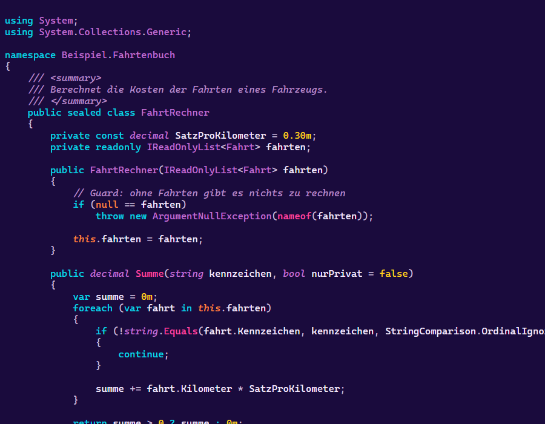

# retro-coding-themes

<p align="center">
   <b>English</b> ·
   <a href="README.de.md">Deutsch</a>
</p>

---

41 colour themes for writing code, 36 dark and 5 light, built from the retro palettes of
[textual-themes](https://github.com/michaelblaess/textual-themes). One derivation, three editors:
Neovim, VS Code and Visual Studio 2026. The same theme looks the same everywhere.

The colours are not copied one to one. A palette made for a TUI has small text fields, an editor
is one large text surface. Every colour is therefore checked and lifted until it is readable,
and syntax colours that would look alike are pulled apart.



**Galleries:** [Neovim](docs/nvim/vorschau.md) · [VS Code](docs/vscode/vorschau.md)

## Install

### Neovim

This repository is the plugin, the colour schemes live in `colors/`. With `vim.pack` on Neovim 0.12:

```lua
vim.pack.add({ "https://github.com/michaelblaess/retro-coding-themes" })
vim.cmd.colorscheme("retro-synthwave")
```

### VS Code

Search the Extensions view for **Retro Themes** by Michael Blaess, or:

```
code --install-extension michaelblaess.retro-themes
```

### Visual Studio 2026

Build the package and install it with the VSIX installer of Visual Studio 2026:

```
uv run python -m retro_coding_themes --vsix
"C:\Program Files\Microsoft Visual Studio\18\Community\Common7\IDE\VSIXInstaller.exe" dist\RetroCodingThemes-0.1.0.vsix
```

Then choose a theme under **Tools > Options > Environment > General > Color Theme**.

## The rules behind the colours

- **Readable first.** Text and syntax reach a contrast of at least 4.5:1, line numbers at least 3:1.
  Hue and saturation stay, so a theme keeps its character.
- **The surface moves away from the text** until the body text reaches 8:1.
- **Syntax colours stay apart**, from each other and from the body text, at least 22 in CIE76.
- **Red is for errors.** No syntax colour sits in the red range, unless red is the theme's lead
  colour. Otherwise a class name would look like an error message.

Every rule is covered by a test over all 41 themes.

## Layout

| Path | Contents |
| --- | --- |
| `src/retro_coding_themes/` | palettes, colour maths and the shared derivation |
| `src/retro_coding_themes/nvim/`, `vscode/`, `visualstudio/` | the mapping onto each editor |
| `colors/` | Neovim colour schemes, generated |
| `vscode/` | the VS Code extension, themes generated |
| `visualstudio/` | the Visual Studio `.pkgdef`, generated |

```
uv run python -m retro_coding_themes            # write all three targets
uv run python -m retro_coding_themes --report   # contrast table only
uv run --extra dev pytest                       # check every theme
```

The Visual Studio themes are written without the Visual Studio SDK. The `.pkgdef` format is not
documented. It was read from the themes that ship with Visual Studio and checked against
Microsoft's `VsixColorCompiler`: the output is byte for byte the same, reference files are in
`tests/referenz/`.

## Liability

These themes are a hobby project and come without any warranty, exactly as the Apache-2.0 licence
describes. They change how the editor looks, nothing else. Use them at your own risk.

## Trade marks and names

The theme names come from [textual-themes](https://github.com/michaelblaess/textual-themes) and
allude to machines, desktops and films that mean something to me. They name colour palettes, not
anyone else's products, and there is no connection to their owners. This project is not
affiliated with Microsoft or the Neovim project.

Microsoft, Visual Studio and Visual Studio Code are trademarks of the Microsoft group of companies.
Any other trade marks mentioned belong to their respective owners.

## Licence

Apache-2.0.
